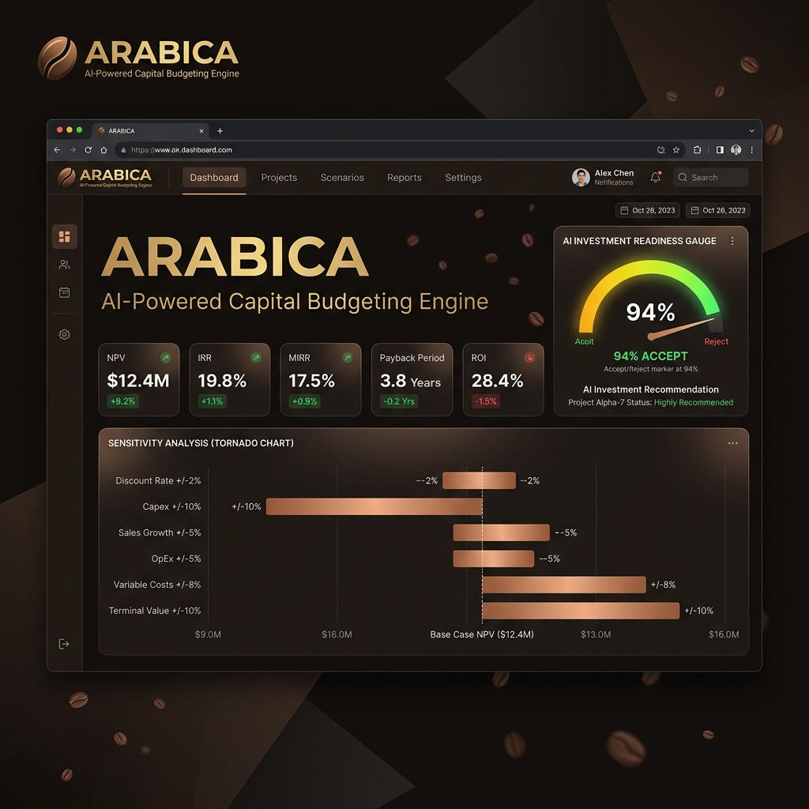

# ARABICA — AI-Powered Capital Budgeting Engine

A full-stack capital budgeting web application that evaluates three mutually exclusive automation investment alternatives for **Hajar Coffee Co.**, a premium B2B coffee roaster in Dubai. Built for a Corporate Finance individual assignment at **SP Jain School of Global Management**.

<p align="center">
  
</p>

| | |
|---|---|
| **Live App** | [arabica-a5gq.vercel.app](https://arabica-a5gq.vercel.app/) |
| **Full Report (PDF)** | [`CF_individual_assignment.pdf`](CF_individual_assignment.pdf) |

---

## What It Does

ARABICA models three capital investment scenarios for Hajar Coffee Co.'s production facility:

| Alternative | Description | Initial Outlay (AED) |
|---|---|---|
| **Alpha** — Full Automation | Complete automated roasting and packaging line | 5,284,000 |
| **Beta** — Semi-Automation | Partial automation with manual quality-control stages | 2,220,000 |
| **Gamma** — Status Quo | No new equipment; retain current manual processes | 200,000 |

For each scenario, the engine computes **13 capital budgeting outputs** in real time as the user adjusts input parameters:

- Initial Cash Flow (CF₀), Annual Operating Cash Flow (CFₜ), Terminal Cash Flow (CFₙ)
- Full cash flow series with year-by-year projections
- Net Present Value (NPV)
- Internal Rate of Return (IRR) and Modified IRR (MIRR)
- Profitability Index (PI)
- Payback Period and Discounted Payback Period
- Accounting Rate of Return (ARR)
- Break-even analysis (accounting, cash, and financial)

The app also includes **sensitivity analysis** (±20% tornado chart), **scenario analysis** (best/base/worst case), and a **side-by-side comparison** of all three alternatives.

---

## AI Architecture

ARABICA uses a dual-layer AI approach — one quantitative, one qualitative:

### 1. Machine Learning — Logistic Regression Classifier

A binary logistic regression model trained from scratch in TypeScript (no external ML libraries). The training pipeline:

1. **Data generation** — 50,000 synthetic capital budgeting scenarios produced via Monte Carlo simulation using a seeded Mulberry32 PRNG (seed `42`) for deterministic reproducibility. Input distributions span realistic ranges for equipment cost, revenue, WACC, project life, tax rate, and other parameters.

2. **Training** — Mini-batch stochastic gradient descent (batch size 256, 100 epochs, initial learning rate 0.1, L2 regularisation λ = 0.001). All features are Z-score standardised. The binary label is `1` if `NPV > 0`, else `0`.

3. **Held-out evaluation on 10,000 test samples:**

   | Metric | Value |
   |---|---|
   | Accuracy | 95.71% |
   | ROC-AUC | 0.9938 |
   | Precision | 95.85% |
   | Recall | 95.80% |
   | F1 Score | 95.83% |
   | Brier Score | 0.0331 |

4. **Inference** — The trained weights and scaler statistics are exported to [`trainedWeights.json`](app/src/ml/trainedWeights.json) and loaded at runtime. An out-of-distribution (OOD) guard flags any input where a feature's Z-score exceeds ±3.5.

> **Honest disclosure:** This is a student project's ML layer. The logistic regression model serves as a quantitative validation tool — it does not replace professional financial judgement.

### 2. Generative AI — Groq-Hosted Llama 3.1 8B Instant

A serverless API route (`/api/analyze`) sends the computed financial metrics to **Groq's** inference API (model: `llama-3.1-8b-instant`) with a structured system prompt. The LLM returns a JSON response containing:

- Accept / Reject / Hold recommendation with confidence level
- A 2–3 paragraph executive narrative referencing specific metrics
- Key value drivers and primary risks

The narrative is generated on-demand (button click), not automatically, to avoid unnecessary API calls.

---

## Tech Stack

| Layer | Technology |
|---|---|
| **Framework** | React 19 + Vite 8 |
| **Language** | JavaScript (app) / TypeScript (ML pipeline) |
| **3D Background** | Three.js via `@react-three/fiber` + `@react-three/drei` |
| **Charts** | D3.js (tornado chart) + Recharts (cash flow, break-even) |
| **Animation** | Framer Motion + GSAP |
| **Styling** | Tailwind CSS 3 |
| **Icons** | Lucide React |
| **AI Inference** | Groq API (Llama 3.1 8B Instant) |
| **Deployment** | Vercel (static + serverless functions) |

---

## Running Locally

```bash
# Clone the repository
git clone https://github.com/samuelalex3737/ARABICA.git
cd ARABICA/app

# Install dependencies
npm install

# (Optional) Regenerate ML weights from scratch
npm run train

# Start the development server
npm run dev
```

The app will be available at `http://localhost:5173`.

### Groq API Key (optional)

The **Generate Executive Summary** button requires a Groq API key. Without one, the rest of the app functions normally.

1. Get a free key at [console.groq.com](https://console.groq.com)
2. Copy `.env.example` to `.env` and add your key:
   ```
   GROQ_API_KEY=gsk_your_key_here
   ```
3. When deploying to Vercel, add `GROQ_API_KEY` as an environment variable in the project settings.

---

## Project Structure

```
ARABICA/
├── app/
│   ├── api/
│   │   └── analyze.js              # Vercel serverless function (Groq API proxy)
│   ├── public/
│   │   └── Report.pdf              # Final submission report
│   ├── src/
│   │   ├── engine/
│   │   │   ├── calculations.js     # All 13 financial output formulas
│   │   │   ├── formatters.js       # Currency/percentage display helpers
│   │   │   └── scenarios.js        # Sensitivity & scenario analysis logic
│   │   ├── ml/
│   │   │   ├── monteCarloSim.ts    # 50k-sample Monte Carlo data generator
│   │   │   ├── logisticRegression.ts  # Training loop (SGD, L2 reg)
│   │   │   ├── evaluation.ts       # Accuracy, ROC-AUC, Brier score
│   │   │   ├── inference.ts        # Runtime prediction + OOD guard
│   │   │   └── trainedWeights.json # Exported model weights & metrics
│   │   ├── components/
│   │   │   ├── ai/                 # Groq AI narrative + recommendation
│   │   │   ├── analysis/           # Scenario comparison & alternatives table
│   │   │   ├── charts/             # Tornado, cash flow, break-even charts
│   │   │   ├── inputs/             # Parameter input form with sliders
│   │   │   ├── metrics/            # NPV/IRR/PI metric cards dashboard
│   │   │   ├── ml/                 # AI probability gauge component
│   │   │   ├── navigation/         # Sidebar navigation
│   │   │   └── webgl/              # Three.js coffee bean 3D background
│   │   ├── data/
│   │   │   └── defaults.js         # Alpha, Beta, Gamma scenario presets
│   │   └── App.jsx                 # Root component & page layout
│   ├── .env.example
│   └── package.json
├── CF_individual_assignment.pdf     # Final submission report
├── report.tex                       # LaTeX source
└── README.md
```

---

## Academic Context & AI Tools Declaration

This application was developed for an individual assignment in the **Corporate Finance** module of the **Master of Artificial Intelligence in Business** programme at **SP Jain School of Global Management, Dubai** (Student ID: `AS25DXB031`).

**AI tools used in development:** Code generation was assisted by AI coding tools (GitHub Copilot / Gemini). The machine learning classifier was designed and trained by the student using a custom TypeScript implementation — no pre-built ML frameworks were used. The generative AI narrative feature uses the Groq-hosted Llama 3.1 model via API. All financial formulas, scenario assumptions, and analytical interpretations are the student's own work, verified against course materials. This declaration is consistent with the AI tools disclosure in Section 10 of the submitted report.

---

## Disclaimer

All financial figures, cost assumptions, and scenario parameters in this application are **illustrative inputs for an academic exercise**. They do not constitute real investment advice, and no actual investment decision should be made based on this tool's outputs. Hajar Coffee Co. is a fictional case study used for pedagogical purposes.
